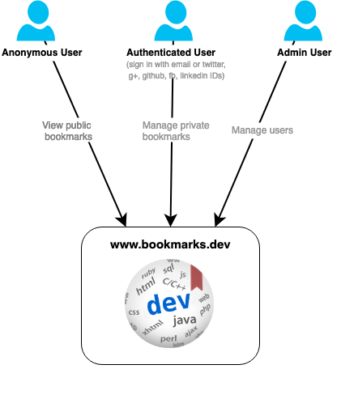

# Bookmark manager for developers & co

 Create and efficiently manage your dev bookmarks. Rate and share the worthy ones (mark as public) and they will be published on Github 
 at [https://github.com/Codingpedia/bookmarks](https://github.com/Codingpedia/bookmarks):
 

---
This repo contains the Angular front-end source code of the [www.bookmarks.dev](http://www.bookmarks.dev) website

The project is developed with the MEAN stack, featuring [MongoDB](https://docs.mongodb.com/manual/), [ExpressJS](https://expressjs.com/en/api.html),
 [Angular](https://angular.io/docs/ts/latest/) and [NodeJS](https://nodejs.org/en/docs/). Authentication and authorization
 is done via [Keycloak](http://www.keycloak.org/): 
 

***

# Development setup

There is a **two-step** setup required for development 
* **front-end setup** concerning angular/angular-cli setup; **this is described on this page**
* **[backend-end setup](https://github.com/Codingpedia/bookmarks-api)** concerning mongodb, keycloak, nodejs

> You need to complete both parts for local development

## Front-end

This project was generated with [Angular CLI](https://github.com/angular/angular-cli)

### Development server

Run `ng serve` for a dev server. Navigate to `http://localhost:4200/`. The app will automatically reload if you change any of the source files.

### Code scaffolding

Run `ng generate component component-name` to generate a new component. You can also use `ng generate directive|pipe|service|class|module`.

### Build

Run `ng build` to build the project. The build artifacts will be stored in the `dist/` directory. Use the `-prod` flag for a production build.

### Running unit tests

Run `ng test` to execute the unit tests via [Karma](https://karma-runner.github.io).

### Running end-to-end tests

Run `ng e2e` to execute the end-to-end tests via [Protractor](http://www.protractortest.org/).
Before running the tests make sure you are serving the app via `ng serve`.

### Further help

To get more help on the Angular CLI use `ng help` or go check out the [Angular CLI README](https://github.com/angular/angular-cli/blob/master/README.md).
